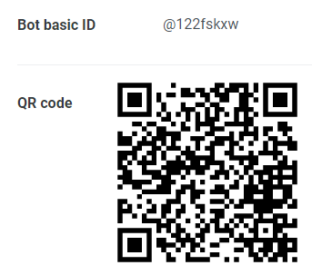

# LINE Bot - 個人勞健保投保薪資及扣款金額查詢  
* LINE BOT - **老闆幫我保多少**  
* 可使用 QR code 或 ID ([@122fskxw](https://line.me/R/ti/p/@122fskxw)) 搜尋，並將機器人家為好友!!  

📢 ***如果使用上發現問題或有任何建議，歡迎開 Issue 或在 Discussions 進行討論!***  

|                 Bot Icon                 |          Join Method           |
| :--------------------------------------: | :----------------------------: |
|  |  |

## 專案簡介  
* 本專案僅針對台灣本國人的勞健保、新制退休金資訊查詢。  
* 因為投保薪資會影響到員工個人權益，之前常有同事來詢問公司目前用多少的金額幫自己投保，所以藉由開發一個 LINE Bot 方便大家自行查詢！  

## 功能  
### 主要服務  
✅ 輸入實際薪資，查詢法定投保薪資、個人負擔金額。  
✅ 輸入健保扣款金額，查詢健保實際投保薪資級距。  
✅ 輸入勞保扣款金額，查詢勞保實際投保薪資級距。  
✅ 輸入新制退休金提撥金額(預設6%)，查詢新制退休金薪資級距。  
✅ 輸入「說明」彈出說明選項清單(`Flex Message`)  

### 其他功能  
✅ 使用 `Flex Message` ，讓手機或電腦使用者都可以正常顯示說明清單，並以點選方式查看各項查詢的詳細使用說明。  
✅ 當「查無資料」或「輸入錯誤格式」時，自動彈出協助訊息。  

### 實際操作畫面  
1. 觸發 `join event` 時(加為好友/解除封鎖)，提示歡迎訊息及 menu。  
2. 觸發 `postback event` 時(點選 menu 選項)，提示該選項詳細說明。  
3. 各查詢指令及回覆內容。  
4. 錯誤提示。  

  

## 開發說明  
### Prerequisite  
* Runtime - Node.js version 10 and up  
* LINE Developers Account for the bot  

### Others  
* Framework - Express  
* Language - TypeScript  
* Database - Sequelize/MySQL
* Deploy - [Railway.app](https://railway.app/)  
* Git
* [line-bot-sdk-nodejs](https://github.com/line/line-bot-sdk-nodejs/tree/next/examples/echo-bot-ts)  

## 更新紀錄  
* 2023/01/13 - 更新 2023 年薪資級距及費率。  
* 2022/11/30 - 第一版本上線。  

## Author  
[Rita Chien](https://github.com/ritachien)  

